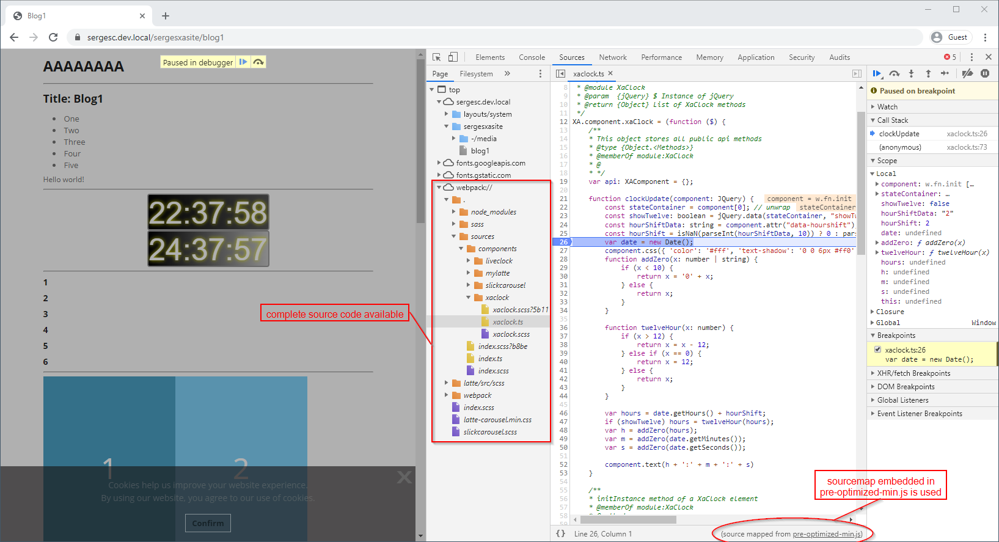
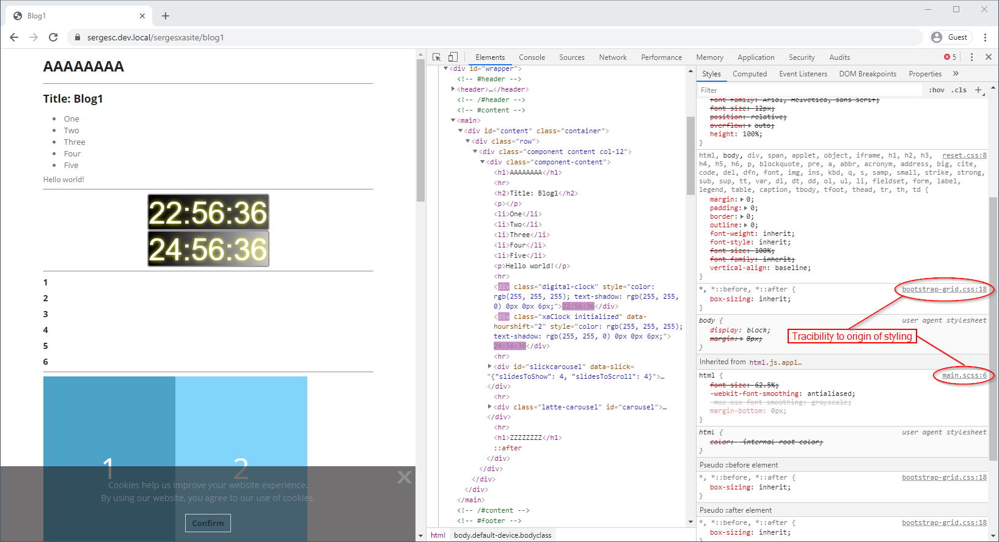
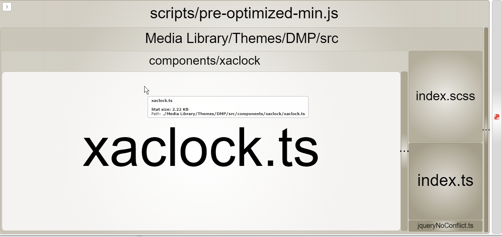

<div align="center">
<h1>SXA Umbrella</h1>
<p>
SXA Umbrella provides the project structure and tooling to optimize the front-end team development workflow in any Sitecore SXA project. 
</p>
</div>

# Introduction

The roots of SXA Umbrella lie in the [SXACLI-enhancements]() project where we embraced the SXA CLI tooling provided by Sitecore that provided a developer-first approach for our front-end developers in SXA development. The out-of-the-box SXA CLI functionality was insufficient for our development workflow so we extended it with an extensive set of additional functionality to support the team development cycle. The SXACLI-enhancement project was built on top of the code-base of SXA CLI and was limited to handle a single SXA theme and the creation of rendering variants using Scriban for a single SXA site. This approach was too limited for our SXA projects, so we decided to do a complete rewrite of the code-base to support the creation of multiple **themes**, **base themes**, **theme extensions**, **grids**, and **rendering variant** collections for multiple sites (for example a shared site and multiple other sites). 

# SXA Umbrella enhancements over standard SXA CLI

The out-of-the-box SXA CLI is a bit limited. It only supports a single gulp task, this task sync's all changes made in the project to Sitecore. So only if you change something it will be deployed to Sitecore. in SXA Umbrella we provide a huge set of enhanced features

## Support for a team development cycle
    
A Sitecore SXA project is team-work, so the tooling must support a typical team development cycle:

- Pull the latest code from source control
- Build all artifacts and do a full deploy to a personal Sitecore instance
- Start watch node for incremental deploy of changed artifacts to Sitecore
- Commit changes to source-control

## Using modern frontend tooling

Built from the ground up using modern front-end tooling, but standing on the shoulders of giants: using the concepts of the SXA CLI, and the end-points provided by SXA Creative Exchange to sync changes directly to your Sitecore environment.

- The SXA Umbrella tooling is completely build using the latest front-end tools like Gulp 4 and Webpack 4
- Support for building your front-end code using the latest version of TypeScript

## Webpack compatible SASS
  
For modern front-end development, we need a bundler for the creation of JavaScript and CSS bundles. Webpack is a good bundler that we use in SXA Umbrella. The problem is that the default Sitecore theme code as delivered in the NPM module `sxa/Theme`, and copied into the project by SXA CLI, is not Webpack compatible due to non-standard SASS language constructs used in the code-base (wildcard imports). SXA Umbrella provides an NPM package `sxa-defaulttheme` in the `local_modules` where the issues are fixed ad the default provided the is turned into a Webpack compatible code-base.
  
## Webpack based scripts transpilation

SXA Umbrella provides Webpack based transpilation of JavaScript, ES and TypeScript from the `src` folder into a single `scripts\pre-optimized-min.js` file to be deployed to Sitecore:

- Support for embedded sourcemaps in *development* mode for full debugging support in the browser using the source files
  
- Optimized, uglified and minified bundle with no sourcemaps in *production* mode
- Bundle analyzer output in the `stats folder in *production* mode

## Webpack based styles transpilation

SXA Umbrella provides Webpack based transpilation of SASS from the `src` folder and (through imports) from the  `sxa-defaulttheme` node module into a single `scripts\pre-optimized-min.css` file to be deployed to Sitecore
    
- Support for embedded sourcemaps in *development* mode for full traceability of the origin of styles
   
- Optimized, minified bundle with no sourcemaps in *production* mode

## Full configuration for TypeScript compilation

[TypeScript - JavaScript that scales](https://www.typescriptlang.org/). The tag-line on the TypeScript site says it all. When working in a team (even a team of one) type-checking is an invaluable tool to prevent issues that can be prevented easily by a computer. SXA Umbrella comes with batteries included by providing an NPM package `sxa-styles` in the `local_modules` providing the TypeScript types for the XA library to build Sitecore SXA compatible components the SXA way

## Minimal configuration

The configuration for SXA Umbrella is as minimal as possible due to convention over configuration. The folder structure provides information about what should be deployed where. We need to configure things like:
- The target Sitecore server and credentials for deployment (config/config.json)
- Per rendering variant collection the GUID of the site to deploy to
- Per theme (base theme, theme, extension theme, grid) we need an entry in the Webpack configuration 

## Full support for debugging of the tooling

The tooling provided by SXA Umbrella is a starting point for your project. You probably want to extens the NPM scripts, the Gulp tasks and the Webpack configuration. SXA Umbrella provides all the required configurations to debug the tooling in Visual Studio Code by providing the a `launch.json` file in the `.vscode` folder with the following debug configurations:

- Gulp: fullDeploy
- Gulp: watch
- Webpack: development
- Webpack: production

# How to get started

In a few simple steps, you can get up and running with SXA Umbrella:

1. Get a Sitecore 9.3 environment with SXA enabled
2. Create a tenant `DMP` with a site `DMP Site` (DMP stands for Digital Marketing Platform) 
3. Navigate to https://github.com/macaw-interactive/sxa-umbrella, and download a zip file with the latest code
4. Unzip the downloaded zip file into a convenient folder for your front-end code  
5. On the Sitecore server open `PathToInstance/Website/App_Config/Include/z.Feature.Overrides` (in previous version of Sitecore it can be `PathToInstance/Website/App_Config/Include/Feature`) folder and remove `.disabled` from the `z.SPE.Sync.Enabler.Gulp.config.disabled` file
6. Switch to the front-end code folder
7. Update the `config/config.json` file to reflect your Sitecore server and credentials
8. Open the front-end code folder with the command-line
9. Run `npm install` (*node.js and npm should be already installed*)
10. Configure the `metadata.json` file with the GUID of the site to deploy to
11. Run `npm run build-deploy-watch` to kickstart the whole process

# SXA Umbrella folder structure

The SXA Umbrella front-end folder contains two important folders for your front-end work:

- **Media Library** - for all themes and grids related stuff
- **Rendering Variants** - for multiple rendering variant collections

## Media Library

The `Media Library` folder follows the structure of Sitecore. Add subfolders for **Extension Themes**, **Base Themes** and **Themes** as required. **Grids** should live is the `Feature` folder (e.g. `Feature/DMP/DMP Bootstrap 4`).

Within `Themes` you can directly create a theme folder (e.g. `Themes/DMP`), of organize new themes in a `Tenant/Site/Theme` structure.

```
Media Library
├── Base Themes
├── Extension Themes
├── Feature
│   └── DMP
│       └── DMP Bootstrap 4
│           └── src
│               ├── grid.scss
│               └── grid.ts
└── Themes
    └── DMP
        ├── fonts
        │   ├── fontawesome
        │   │   ├── fontawesome-webfont.eot
        │   │   ├── fontawesome-webfont.svg
        │   │   ├── fontawesome-webfont.ttf
        │   │   ├── fontawesome-webfont.woff
        │   │   ├── fontawesome-webfont.woff2
        │   │   └── FontAwesome.otf
        │   └── opensans
        │       ├── opensans-bold.woff
        │       ├── opensans-light.woff
        │       ├── opensans-semibold.woff
        │       └── opensans.woff
        ├── images
        │   ├── arrow-left.png
        │   ├── arrow-right.png
        │   ├── overlay-bg.png
        │   ├── player.png
        │   ├── radiobox.png
        │   ├── sprite-flag.png
        │   └── square_bg.png
        └── src
            ├── components
            │   └── xaclock
            │       ├── xaclock.scss
            │       └── xaclock.ts
            ├── theme
            │   └── sass
            │       ├── component-accordion.scss
            │       └── main.scss
            ├── index.scss
            ├── index.ts
            ├── jqueryNoConflict.ts
            └── theme.scss
```

## Rendering Variants

The `Rendering Variants` folder can contain one or more sub-folders for rendering variant collections. Each collection belongs to a site, and will be deployed to the folder `<site>/Presentation/Rendering Variants`. The folder needs to have sub-folders `-/scriban` because the Scriban update end-point in Sitecore requires this in the file path.

A sample rendering variants collection is provided for a site `DMP Site`:

```
Rendering Variants
└── DMP Site
    └── -
        └── scriban
            ├── Page Content
            │   └── Scriban Content
            │       └── item.scriban
            └── metadata.json
```

The `metadata.json` file configures the id of the site where the rendering variants are deployed to, e.g.:

```json
{
    "siteId": "{384B74E8-3DA0-472F-9F4B-F0E851B99EE0}",
    "database": "master"
}
```


# NPM Scripts to support team development workflow

The NPM scripts are provided for the optimal team development workflow.

## build-deploy-watch

Execute `npm run build-deploy-watch` to build everything, deploy to Sitecore and go into watch mode. This is the first thing to do after a pull request to get the latest changes made by the team, and make sure that these changes are reflected on the Sitecore server used for your daily development work. The JavaScript and CSS bundles are build in *development* mode and include sourcemaps for optimal support for debugging.

Make sure that the Visual Studio solution containing Possible Unicorn items to be synchronized is built and deployed first (if applicable).

## watch

Execute `npm run watch` to go directly into watch mode. You can do this if you start your work without getting the changes made by your team first to get. You get a quick start of the day and can continue with your work. The JavaScript and CSS bundles are build in *development* mode and include sourcemaps for optimal support for debugging.


## build:dist

Execute `npm run build:dist` when you want to create a *production* build of your code to the `dist` folder. This command is normally executed on a build server.

The JavaScript bundles are uglified and minified and do not contain sourcemaps. The CSS bundles are minified and prepared for multiple browser support and do not contains sourcemaps.

Bundle analyzer output is written to the `stats folder to give you more insights in the size of the different modules included in your bundle:



Note that during this build the resulting artifacts for themes and grids will end-up in the `dist` folder in the root of the front-end folder. These artifacts should be part of the deployment package for Sitecore together with a custom script to deploy the files as items in Sitecore. Preferably don't deploy these files using unicorn, because the build of JavaScript and CSS bundles should be executed on s build server

The rendering variant items should be deployed using Unicorn, because these files need to be deployed to Sitecore "as is", no build procvess is needed.

## Other NPM scripts

Note that there are many more "internal" npm scripts available in the `package.json`, but those are not needed in your day-to-day work.

# Writing components the SXA way

There is an example of a TypeScript component written the SXA way at `sources/components/xaclock`.

TypeScript types for SXA way of writing components is available as  `sxa-types/xa`.

*More information will be added for building components the SXA way*
   
# Creating a custom theme

We tried to minimize the modification of the default provided theme code. A copy of the theme code provided by Sitecore lives in the local module `local_modules/sxa-defaulttheme`. This code is based of the code provided in the nuget package `@sxa/Theme` and provides the SASS styling for all provided components. The SASS code is copied and modified by a gulp task as provided in the `sxa-defaulttheme` package. This code can be regenerated if required, for example when an updated NPM package with fixes in the theme code comes out. The theme code is made compatible for consumption by Webpack.

Our philosophy is to not touch the SASS code at all as provided in the `sxa-defaulttheme` package, but create overrides in the theme folder.

- The `images` and `fonts` are copied over from the `sxa-defaulttheme` package
- The root of the SASS is in the file `<theme>/src/index.scss`, this file is included by `<theme>/src/index.ts` and the extraction of the CSS bundle is handled by webpack.
- Overrides on the provided SASS for the theme should be done in the file `<theme>/src/theme.scss`. In this way it is easy to create multiple themes from the same SASS codebase by just providing different `theme.sass` files in the transpilation.
- The file `<theme>/index.ts` is the entry point of all code (TypeScript, ES, JavaScript, SASS)

For each theme or grid an entry must be provided in the `config/webpack.config.js` file. We currently have the following configuration for the `DMP` theme and the `DMP Bootstrap 4` grid:

```javascript
const customEntryOutputConfigurations = {
	grid_DMP_Bootstrap_4: {
		entry: {
			'pre-optimized-min': ['../Media Library/Feature/DMP/DMP Bootstrap 4/src/grid.ts']
		},
		output: {
			path: path.resolve(__dirname, '../Media Library/Feature/DMP/DMP Bootstrap 4'),
			library: 'grid_DMP_Bootstrap_4',
			libraryTarget: 'umd',
			filename: 'scripts/[name].js'
		}
	},

	theme_DMP: {
		entry: {
			'pre-optimized-min': [ '../Media Library/Themes/DMP/src/index.ts' ]
		},
		output: {
			path: path.resolve(__dirname, '../Media Library/Themes/DMP'),
			library: 'theme_DMP',
			libraryTarget: 'umd',
			filename: 'scripts/[name].js'
		}
	}
};
```

This configuration can be modifed and extended for additional themes and grids.

# Creating a custom grid

SXA Umbrella assumes the use of **Bootstrap 4** as the basis for new grids. The SASS bootstrap code is added as an NPM package and a new variation of the **Bootstrap 4** grid can be easily created by referencing the SASS grid files from the NPM package.

An example grid `DMP Bootstrap 4``` is provided in the SXA Umbrella code base.


```
Media Library
├── Feature
│   └── DMP
│       └── DMP Bootstrap 4
│           └── src
│               ├── grid.scss
│               └── grid.ts
```

The `grid.ts` file is necessary to build the grid bundle. it includes the `grid.scss` file:

```javascript
import "./grid.scss";
```

The `grid.scss` file is used to provide SASS variable overrides on the default Bootstrap 4 grid:

```scss
// overwrites
$grid-gutter-width: 80px !default;

@import "~bootstrap/scss/functions.scss";
@import "~bootstrap/scss/mixins.scss";
@import "~bootstrap/scss/variables.scss";

@import "~bootstrap/scss/grid.scss";
```

# Frequently asked questions

### Why is the `config/config.json` file a JSON file and not JavaScript?

It should be easy for tools to read the configuration settings, also for non-JavaScript tools like PowerShell scripts.

### Why do I need to add an entry per theme in the Webpack configuration file?

The file `config\webpack.config.js` contains multiple output configurations as shown in the [multi-compiler](https://github.com/webpack/webpack/tree/master/examples/multi-compiler) example. We could easily automate the generation of the required configurations if all themes needed to be compiled alike, but we see potential cases where a different configuration is required. A good example is when a theme contains additions output configurations for a React bundle. 

### Why does a rendering variants collection for a web site to be in a folder `-/scriban`?

The used end-point for uploading Scriban files checks the Scriban file paths for the occurence of the string `-/scriban` to determine the relative path within the folder `<sites>/Presentation/Rendering Variants` folder to deploy to.

### Can the front-end folder be partitioned into multiple deployment packages?

When you are working with multiple teams on separate solutions for a Sitecore environment that should be deployed separately, there is no reason why you can't have multiple solutions with a front-end folder containing the SXA Umbrella setup.


### Can the `sxa-defaulttheme` be recreated?

The `sxa-defaulttheme` local module contains a Gulp task `create-fixed-defaulttheme-sass-for-webpack` that can be executed by the NPM script `build` to copy and fix the SASS code for the default theme as provided by Sitecore in the npm package @sca/Theme by expanding wildcard imports to the actual imports, otherwise, the sass can't be transpiled by webpack. Recreation is required in the following cases:

- Sitecore provides an updated version of the default theme by updating the @sxa/theme NPM package (currently version 1.0.1)
- Modifications must be made to the flags sprite (resulting image `sprite-flag.png` is copied over to the `DMP` theme)

# Blog posts about Sitecore SXA CLI

The blog posts below contain some important information to get the initial configuration of your system in good shape to start working with Sitecore SXA CLI:

- [Sitecore 9.3 - create a custom theme for SXA using SXA CLI](https://www.sergevandenoever.nl/sitecore-93-custom-theme-with-SXA-CLI/)
- [Sitecore 9.3 SXA CLI - get item fields](https://www.sergevandenoever.nl/Sitecore-93-SXA-CLI-GetItemFields/)
- [Sitecore SXA theme investigation](https://www.sergevandenoever.nl/Sitecore-SXA-Theme-Investigation/)